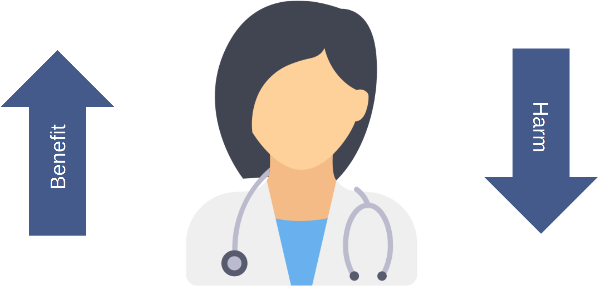
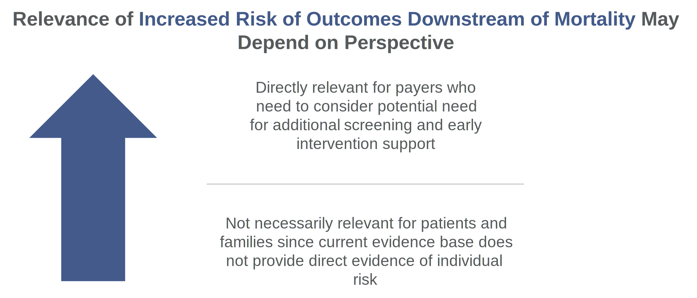
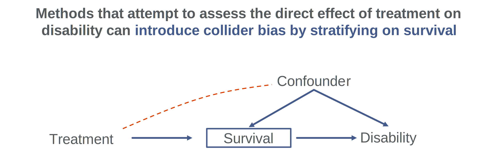

```{r setup, include=FALSE}
library(flexdashboard)
library(svglite)
library(dplyr)
devtools::load_all()
```

### Balancing benefits and harm

```{r}

```

------------------------------------------------------------------------

Clinical trials and subsequent meta-analysis tend to include multiple outcomes
that have decision making implications. Generally we are interested in finding
interventions that maximize benefit while minimizing harm. There are many
methods that can be used to achieve this, but the most important consideration
often has nothing to do the final calculations used.

### Complex complications

```{r, fig.width= 8, dev = "svglite"}

 data("dat")


dat %>%
  dplyr::mutate(
    out = factor(out, levels = c("mort", "cp"), 
                 labels = c("Mortality", "Disability")
    )
  ) %>%
  ggplot2::ggplot(ggplot2::aes(y = point, ymin = lwr, ymax = upr, x = study)) +
  ggplot2::geom_pointrange(colour = "#375180", size = 1) +
  ggplot2::coord_flip() +
  ggplot2::facet_wrap(~out) +
  ggplot2:::geom_hline(yintercept = 1, linetype = 2) +
  ggplot2::theme_minimal(base_size = 16) +
  ggplot2::labs(
    x = "",
    y = "Odds Ratio (lower is better)",
    title = "Increased Harms Can Appear in Outcomes Downstream from Mortality Even If They Don't Exist at the Patient Level"
  ) +
  ggplot2::theme(
    axis.text.y = ggplot2::element_blank(),
    plot.title = ggtext::element_textbox_simple(hjust = 1, width = grid::unit(1, "npc"), height = grid::unit(0.2, "npc"))
  ) 

  
```

------------------------------------------------------------------------

A classic example of weighing benefits and harms in neonatology is the benefit
of post-natal steroids on death and BPD weighed against the increased risk of
cerebral palsy. The problem is that since infants who die can't develop cerebral
palsy when we simulate many trials with a benefit on mortality and no effect on
development, it still looks like the intervention may be associated with harm. 

### So what?

```{r }

```

------------------------------------------------------------------------

Comparing mortality against cerebral palsy can make sense from a resource allocation standpoint: funders need to consider that an intervention that an
intervention that improves mortality might result in additional resource requirements for follow-up and early intervention. This is very different from
the problem faced by clinicians who want to make sure their intervention isn't
creating too much additional risk in an individual patient. A clinician who uses
these outputs to inform discussions with patients might inappropriately suggest
that the therapy may increase the risk of developmental delay, or alternatively
could present results of a composite (eg Death or disability) and say there is
no evidence of benefit.

### What can we do?

```{r}

```

--- 
While it's tempting to try to analyze the effect on disability directly doing
so would likely induce collider bias which will require careful consideration.
The best way forward will depend on which perspective you need and which assumptions you're willing to make.
